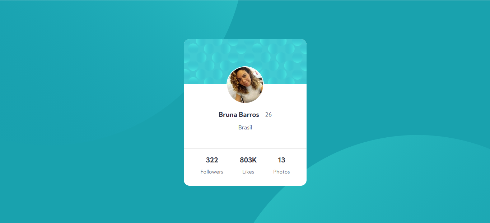
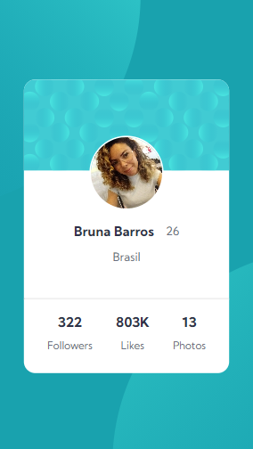

# Frontend Mentor - Componente do cartão de perfil

Esta é uma solução para o [desafio do componente do cartão de perfil no Frontend Mentor](https://www.front//or.io/challenges/profile-card-component-cfArpWshJ). 
Os desafios do Frontend Mentor ajudam a melhorar as habilidades de desenvolvimento ao construir projetos reais.

## Índice
- [Descrição](#descrição)
  - [O desafio](#o-desafio)
  - [Screenshot](#screenshot)
  - [Links](#links)
- [Meu processo](#meu-processo)
  - [Ferramentas](#ferramentas)
  - [O que eu aprendi](#o-que-eu-aprendi)
  
## Descrição

### O desafio

- Elabore o projeto de acordo com os designs fornecidos

### Screenshot
Versão Web

Versão Mobile

### Links

- [Solução](https://www.frontendmentor.io/solutions/componente-do-carto-de-perfil-zTIR23csk)
- [Github Page](https://brunanunesbarros.github.io/profile-card-component/index.html)

## Meu processo

### Ferramentas

- HTML5 semântico
- CSS
- Flexbox
- Mobile-first 

### O que eu aprendi

Com este projeto eu consegui colocar em prática o uso da abordagem Mobile-first e melhorar minhas habilidades com CSS de modo geral, um exemplo foi o uso do display: flex, e o background com múltiplas imagens (não sabia que era possível), inclusive tive bastante dificuldade na hora de manipular essas imagens circulares, quem tiver uma abordagem melhor para sugerir fique à vontade. 

